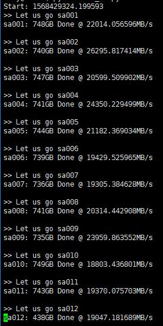

# AutoRclone: rclone copy/move/sync (automatically) with service accounts (still in the beta stage)
Many thanks to [rclone](https://rclone.org/) and [folderclone](https://github.com/Spazzlo/folderclone) for making this possible.

- [x] Create service accounts using script.
- [x] Add massive service accounts into rclone config file.
- [x] Add massive service accounts into groups for your organization.
- [x] Automatically switch accounts when rclone copy/move/sync.
- [x] Windows system is supported.

Step 1. Copy code to your VPS or local machine
---------------------------------
_Before everything, install python3 because we use python as our programing language._

### For Linux system
Install
[screen](https://www.interserver.net/tips/kb/using-screen-to-attach-and-detach-console-sessions/),
`git` 
and [latest rclone](https://rclone.org/downloads/#script-download-and-install). 
If in Debian/Ubuntu, directly use this command
```
sudo apt-get install screen git && curl https://rclone.org/install.sh | sudo bash
```
After all dependency above are successfully installed, run this command
```
sudo git clone https://github.com/xyou365/AutoRclone && cd AutoRclone && sudo pip3 install -r requirements.txt
```
### For Windows system
Directly download this project, download and copy [latest rclone](https://rclone.org/downloads/) into PATH. Then, run the following command in a commandline initialized inside your AutoRClone (this project) folder.
```
pip3 install -r requirements.txt
```

Step 2. Generate service accounts
---------------------------------

[What is service account?](https://cloud.google.com/iam/docs/service-accounts) 

[How to use service account in rclone?](https://rclone.org/drive/#service-account-support)

Let us create only the amount of service accounts that we need. 

**Warning:** Abuse of this feature is not the aim of autorclone and we do **NOT** recommend that you make a lot of projects. Creating just one project and 100 service accounts is plenty. Abuse of this service might get your projects banned by Google. 

Create a project and enable the following APIs. You can do this [here](https://developers.google.com/workspace/guides/create-project).
..* Google Drive API.
..* Resource Manager API.

Create one service account as shown in the "Console" tab [here](https://cloud.google.com/iam/docs/creating-managing-service-accounts?authuser=4#creating). Name it anything, add description if you feel so; it doesn't matter. Now, create keys for it as shown [here](https://cloud.google.com/iam/docs/creating-managing-service-account-keys?authuser=4#creating_service_account_keys). Save the JSON file as "credentials.json" in this project folder.

**Note.** Each service account can copy about 750GiB a day. 99 service accounts hence allows 75TiB of data transfer a day.

Since each project service account count capped to 100, we can create 99 more service accounts. You may leave the service accounted created above by itself. Create 99 service accounts as follows. 

```
python gen_sa.py --create-sas -pid <project ID> -sp <prefix for SA names, you may ignore> -sc 99
```

If you don't know your project ID, click on the dropdown right of "Google Cloud Platform" [here] (https://console.cloud.google.com/). You can see the list of projects and their corresponding IDs. You need the ID of the project you created above. You may also use the following to list all the projects in your Google Cloud.

```
python gen_sa.py --list-projects
```

Step 3. [Optional] Add service accounts to Google Groups
---------------------------------
_This step is recommended for hassle free, long term use, but is optional._

We use Google Groups to manager our service accounts, keeping in mind the [official limits pertinent.](https://support.google.com/a/answer/7338880?hl=en).

### For GSuite Admin
1. Turn on the Directory API [here](https://developers.google.com/admin-sdk/directory/v1/quickstart/python). Save the generated JSON file to the `credentials` folder.

2. Create group for your organization in the [admin console](https://support.google.com/a/answer/33343?hl=en). You will have an address to the newly created Google Group, say, `email@example.com`.

3. Run ```python add_to_google_group.py -g email@example.com```

_Run `python3 add_to_google_group.py -h` for help with flags._

### For normal user
Create a [Google Group](https://groups.google.com/) and then add the service accounts as members from `/accounts/sas-list.txt`. You may add 10 at a time to avoid captha. The total [limit](https://support.google.com/a/answer/6099642?hl=en#zippy=%2Cgroup-creation-join-requests-and-invitations%2Cmembership%2Climits-related-to-trial-accounts) is 200 a day and optimistically, you would have a good leeway. 

Step 4. Add service accounts or Google Groups into Team Drive
---------------------------------
_If you do not use Team Drive, just skip._
**Warning:** It is **NOT** recommended to use service accounts to clone "to" folders that are not in teamdrives, SA work best for teamdrives. 

If you have already created Google Groups (**Step 2**) to manager your service accounts, add the group address `sa@yourdomain.com` or `sa@googlegroups.com` to your source Team Drive (tdsrc) and destination Team Drive (tddst). 
 
Otherwise, add service accounts directly into Team Drive.
> Enable the Drive API in [Python Quickstart](https://developers.google.com/drive/api/v3/quickstart/python) 
and save the `credentials.json` into project root path if you have not done it in **Step 2**.
> - Add service accounts into your source Team Drive:
`python3 add_to_team_drive.py -d SharedTeamDriveSrcID`
> - Add service accounts into your destination Team Drive:
`python3 add_to_team_drive.py -d SharedTeamDriveDstID`

Step 5. Start your task
---------------------------------
Let us copy hundreds of TB resource using service accounts. 
**Note**: Sarcasm, over abuse of this (regardless of what cloning script you use) may get you noticed by google, we recommend you dont be a glutton and clone what is important instead of downloading entire wikipedia.

#### For server side copy
- [x] publicly shared folder to Team Drive
- [x] Team Drive to Team Drive
- [ ] publicly shared folder to publicly shared folder (with write privilege)
- [ ] Team Drive to publicly shared folder
```
python3 rclone_sa_magic.py -s SourceID -d DestinationID -dp DestinationPathName -b 1 -e 600
```
- _For meaning of above flags, please run python3 rclone_sa_magic.py -h_

- _Add `--disable_list_r` if `rclone` [cannot read all contents of public shared folder](https://forum.rclone.org/t/rclone-cannot-see-all-files-folder-in-public-shared-folder/12351)._

- _Please make sure the Rclone can read your source and destination directory. Check it using `rclone size`:_

1. ```rclone --config rclone.conf size --disable ListR src001:```

2. ```rclone --config rclone.conf size --disable ListR dst001:```

#### For local to Google Drive (needs some testing)
- [x] local to Team Drive
- [ ] local to private folder
- [ ] private folder to any (think service accounts cannot do anything about private folder)
```
python3 rclone_sa_magic.py -sp YourLocalPath -d DestinationID -dp DestinationPathName -b 1 -e 600
```

* Run command `tail -f log_rclone.txt` to see what happens in details (linux only).



Also let's talk about this project in Telegram Group [AutoRclone](https://t.me/AutoRclone)

[Blog（中文）](Blog (中文) 
https://gsuitems.com/index.php/archives/13/) | [Google Drive Group](https://t.me/google_drive) | [Google Drive Channel](https://t.me/gdurl)  


